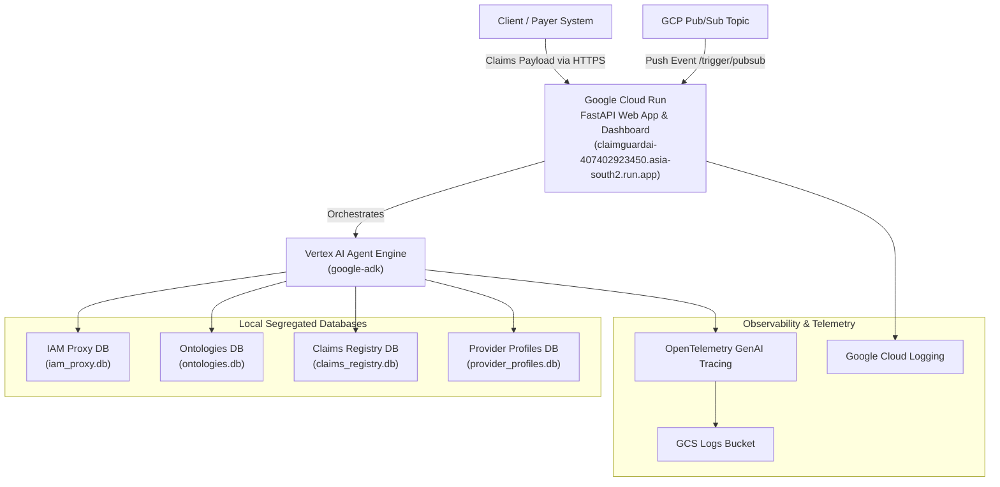
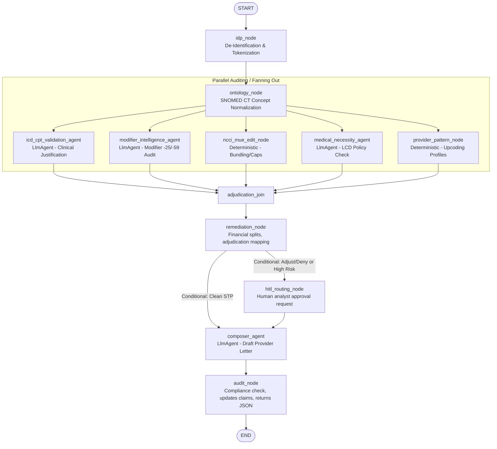

# ClaimGuardAI: Solution Architecture & Design Brief

ClaimGuardAI is an event-driven, intelligent medical coding audit and claim adjudication system. It automates the review of medical claims by evaluating billed codes against clinical documentation (SOAP notes), national billing standards (NCCI and MUE), medical necessity rules (LCD policies), and historical provider behaviors. 

This document outlines the solution brief, system architecture, integration points, multi-agent orchestration, security/observability measures, and the project structure/installation approach.

---

## 1. Solution Brief

In health insurance claim processing, **improper coding**, **upcoding**, and **billing violations** cost payers billions of dollars annually. Traditional claim adjudication engines rely entirely on rigid, rule-based logic which fails to interpret unstructured medical documentation like clinical SOAP notes. 

**ClaimGuardAI** bridges this gap:
*   **Intelligent Auditing**: Combines deterministic rules with LLM-powered clinical reasoning to verify if billed codes (CPT/HCPCS/ICD-10) are clinically justified by unstructured SOAP notes.
*   **Privacy-First (HIPAA Compliant)**: Employs a local de-identification proxy to strip Protected Health Information (PHI) before forwarding data to LLMs.
*   **Human-In-The-Loop (HITL)**: Automatically routes claims containing complex anomalies, high financial adjustments, or high-risk provider profiles to human claims analysts.
*   **Straight-Through Processing (STP)**: Allows clean claims to pass through with zero human intervention, drastically reducing processing latency.

---

## 2. High-Level Architecture Design

ClaimGuardAI is built using a modern, decoupled architecture centered on **Google Cloud Platform (GCP)**. It exposes a web dashboard and API endpoints via **FastAPI** hosted on **Google Cloud Run**, and orchestrates workflows using the **Google Agent Development Kit (ADK) 2.0** framework.



### Component Details
1.  **FastAPI Gateway (Google Cloud Run)**: Accessible at `https://claimguardai-407402923450.asia-south2.run.app`. It acts as the ingestion gateway for claims processing. It hosts the static analytics dashboard and exposes API endpoints for Pub/Sub push integrations.
2.  **Vertex AI Reasoning Engine**: Hosts the core multi-agent workflows defined with `google-adk`, running python version 3.12 with resource limits optimized (4 CPUs, 8Gi memory).
3.  **Segregated Database Layer**: Uses four isolated SQLite databases (`sqlite:///app/db/*.db`) to ensure structural data separation:
    *   `iam_proxy.db`: Securely stores actual PII/PHI mapped to random surrogate identifiers.
    *   `ontologies.db`: Contains medical billing reference data (CPT, ICD-10, SNOMED, NCCI ptp edits, and MUE limits).
    *   `claims_registry.db`: Stores final claim adjudication metrics, line-level outcomes, CARC/RARC codes, and compliance audit logs.
    *   `provider_profiles.db`: Tracks provider NPIs, upcoding frequency patterns, and risk tiers (LOW vs. HIGH).

---

## 3. Integration Design

### Pub/Sub Push Trigger Integration
ClaimGuardAI acts as an **ambient (event-driven) service**. It is designed to sit downstream of a payer's intake queue, subscribing to a Pub/Sub topic.

*   **Endpoint**: `POST /apps/app/trigger/pubsub`
*   **Normalized Pathing**: To prevent errors caused by environment-specific GCP paths, a custom FastAPI middleware (`PubSubNormalizeMiddleware`) intercepts requests and strips subscription paths (e.g., from `projects/<project-id>/subscriptions/<subscription-name>` to `<subscription-name>`).

### Ingestion Payload Schema
```json
{
  "patient_name": "John Doe",
  "dob": "10/12/1985",
  "ssn": "000-12-3456",
  "provider_name": "Dr. Sarah Smith",
  "provider_npi": "1234567890",
  "claim_id": "CLM-99881",
  "soap_note": "Subjective: Patient reports severe right knee pain for 2 weeks... Objective: Mild swelling noted... Assessment: Knee osteoarthritis... Plan: Directing physical therapy.",
  "lines": [
    {
      "cpt": "99214",
      "icd": "M17.11",
      "units": 1,
      "modifier": "",
      "charge": 250.00
    }
  ]
}
```

---

## 4. Multi-Agent Orchestration Approach

The auditing process uses a **Fan-Out/Fan-In Multi-Agent Workflow** orchestrated via the ADK 2.0 `Workflow` engine. It enables parallel execution of domain-specific validation layers before merging results for final financial calculation.



### Node-by-Node Workflows
1.  **`idp_node` (De-Identification)**: Intercepts the raw payload, hashes patient identifiers (e.g., generating `PP-4829-U` and `REF-7721-AC`), registers them in the `iam_mappings` table, and redacts PII/PHI from the SOAP notes using regex rules.
2.  **`ontology_node` (Symptom Matching)**: Scans de-identified SOAP notes for clinical concepts, mapping symptoms to SNOMED CT terminology and aligning them with diagnosis ICD codes.
3.  **Parallel Auditing Agents (Fanning Out)**:
    *   `icd_cpt_validation_agent` (LLM-based): Analyzes clinical notes to verify if CPT codes match patient symptoms.
    *   `modifier_intelligence_agent` (LLM-based): Identifies upcoding, unbundling, or missing modifiers (e.g., `-25` or `-59`).
    *   `ncci_mue_edit_node` (Deterministic): Validates claims against NCCI Procedure-to-Procedure (PTP) bundling rules and Medically Unlikely Edits (MUE) daily quantity caps.
    *   `medical_necessity_agent` (LLM-based): Matches procedural codes to diagnosis guidelines under Local Coverage Determination (LCD) policies.
    *   `provider_pattern_node` (Deterministic): Cross-references provider NPIs against historical metrics. High-risk profiles trigger automated downcoding (e.g., reducing `99215` to `99212`).
4.  **`adjudication_join`**: Merges all audit outputs.
5.  **`remediation_node` (Financial Adjudication)**: Calculates claim math (e.g., 80% insurer payment vs 20% patient responsibility) and outputs remediation instructions. If a claim is adjusted/denied, it flags the claim for manual analyst review.
6.  **`hitl_routing_node` (Human-in-the-Loop)**: Suspends execution via an ADK `RequestInput` if the claim needs human approval. The state is resumed only when a claims analyst submits an `Approve` or `Override` action.
7.  **`composer_agent` (LLM-based)**: Automatically drafts a formal adjudication letter detailing payments, adjustments, and Claim Adjustment Reason Codes (CARC/RARC).
8.  **`audit_node` (Compliance Audit)**: Saves final outputs to the claims registry database, compiles a HIPAA-compliant evidence trail, and yields the final JSON payload.

---

## 5. Security, Observability, and Auditability Design

### Security & Privacy (HIPAA Compliance)
*   **Zero-PHI LLM Policy**: Protected Health Information (name, date of birth, SSN, phone numbers, and dates) is stripped out within the `idp_node` prior to sending any data to Vertex AI Gemini models.
*   **Tokenization Mapping**: Re-identification maps are stored entirely inside `iam_proxy.db`, which resides behind a secure corporate boundary. The external-facing Cloud Run container operates entirely on de-identified tokens (`pseudo_patient_id`, `case_reference_id`).

### Observability & Telemetry
*   **OpenTelemetry (OTel)**: Fully instrumented with OTel semantic conventions for generative AI. 
*   **GCS Telemetry Archival**: Telemetry logs are uploaded to Google Cloud Storage (defined by `LOGS_BUCKET_NAME`) in `.jsonl` format.
*   **Zero-Prompt Logging Mode**: To protect client IP and ensure absolute security, telemetry content capture is restricted to `NO_CONTENT`, saving metadata only (token usage, latency, latency distributions) and excluding actual system prompts and model responses.

### Auditability
*   Every adjudication is saved in `claim_adjudications` and `claim_line_adjudications` tables containing line-by-line success/fail reasons.
*   An audit trail of the exact reasoning (probabilistic claims, NCCI violations, LCD policies) is stored in the database for billing disputes or operational analytics.

---

## 6. Project Structure & Installation Approach

### Project Structure
```
coding-edit-intel-agent/
├── app/                        # Core Application Code
│   ├── app_utils/              # Typing schemas, telemetry config
│   ├── db/                     # DB files & SQLite connection layer
│   │   ├── connections.py      # SQLAlchemy engine factories
│   │   └── init_db.py          # Database seeding scripts
│   ├── services/               # Modular Domain Services
│   │   ├── adjudication_service.py # Core payment & adjustment logic
│   │   ├── iam_service.py      # PHI scrubbing & token proxy
│   │   ├── snomed_service.py   # Symptom parsing
│   │   ├── rule_service.py     # NCCI, MUE, LCD rules
│   │   ├── pattern_service.py  # Provider profiling
│   │   └── log_service.py      # Logging utils
│   ├── static/                 # Front-end Assets (dashboard UI)
│   ├── agent.py                # Main ADK workflow definition
│   ├── agent_runtime_app.py    # Vertex AI Reasoning Engine wrapper
│   └── fast_api_app.py         # Cloud Run FastAPI REST server
├── tests/                      # Testing Directories (unit/integration)
├── Dockerfile                  # Container definition for Cloud Run
├── Makefile                    # Task automation shortcuts
├── pyproject.toml              # UV dependency configurations
└── uv.lock                     # Locked dependencies
```

### Installation Approach

#### Prerequisites
*   Install **`uv`** (Python package manager):
    ```bash
    powershell -ExecutionPolicy ByPass -c "irm https://astral.sh/uv/install.ps1 | iex"
    ```
*   Install the **`google-agents-cli`** utility:
    ```bash
    uv tool install google-agents-cli
    ```

#### Step-by-Step Installation
1.  **Clone the Repository**:
    ```bash
    git clone https://github.com/viviktaadvisory-art/coding-edit-intel-agent.git
    cd coding-edit-intel-agent
    ```
2.  **Initialize Environment & CLI**:
    ```bash
    uvx google-agents-cli setup
    ```
3.  **Install Dependencies**:
    ```bash
    agents-cli install
    # Or using the Makefile:
    make install
    ```
4.  **Seed SQLite Databases**:
    ```bash
    uv run python app/db/init_db.py
    ```

#### Running & Testing Locally
*   **Launch Dev Playground**:
    ```bash
    make playground
    ```
*   **Run Local FastAPI Server**:
    ```bash
    make run
    # Starts the server at http://localhost:8080
    ```
*   **Run Automated Test Suites**:
    ```bash
    uv run pytest tests/unit tests/integration
    ```

---

## 7. Cloud Deployment (Google Cloud Run)

The FastAPI application is packaged as a Docker image and deployed to **Google Cloud Run** at:
`https://claimguardai-407402923450.asia-south2.run.app`

### Containerization (`Dockerfile`)
*   **Base Image**: `python:3.12-slim`
*   **Package Manager**: `uv` (pinned version `0.8.13`)
*   **Exposed Port**: `8080`
*   **Execution Entrypoint**: Runs the FastAPI app using Uvicorn:
    ```dockerfile
    CMD ["uv", "run", "uvicorn", "app.fast_api_app:app", "--host", "0.0.0.0", "--port", "8080"]
    ```

### Cloud Run Deployment Command
```bash
gcloud run deploy claimguardai \
  --image gcr.io/<your-project-id>/claimguardai:latest \
  --platform managed \
  --region asia-south2 \
  --allow-unauthenticated \
  --set-env-vars "LOGS_BUCKET_NAME=claimguardai-telemetry-logs,GOOGLE_CLOUD_LOCATION=global"
```
